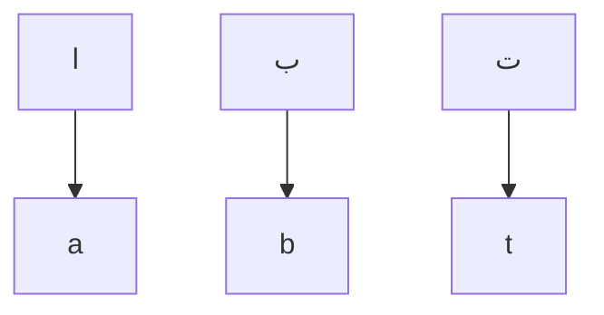

___
```
     _    ____  ____  _____ _   _  
    / \  |  _ \|___ \| ____| \ | | 
   / _ \ | |_) | __) |  _| |  \| | 
  / ___ \|  _ < / __/| |___| |\  | 
 /_/   \_\_| \_\_____|_____|_| \_| 
```
# AR2EN
[AR2EN](https://haithamaouati.github.io/AR2EN/) — **Arabic** to **English** converter

You want to convert a text from **Arabic** to **English** characters so that you can read it with ease? Below you will find a **romanization** or **transliteration** tool that will help you do just that. That way, you will be able to read words the way they sound phonetically.

## Table of Contents
- [Demo](#demo)
- [Romanization](#romanization)
  - [Function](#function)
  - [Table of Characters](#table-of-characters)
- [Author](#author)
- [License](#license)

## Demo
Version: **3.0**
[https://haithamaouati.github.io/AR2EN](https://haithamaouati.github.io/AR2EN/)

## Romanization

###### Function
Here is a function flow chart:



###### Table of Characters

Arabic | English
--- | ---
ا|a
أ|a
إ|a
آ|a
ب|b
ت|t
ث|th
ج|j
ح|h
خ|kh
د|d
ذ|dh
ر|r
ز|z
س|s
ش|sh
ص|s
ض|d
ط|t
ظ|th
ع|aa
غ|gh
ف|f
ق|q
ك|k
ل|l
م|m
ن|n
ه|h
و|w
ي|y
ئ|a
ء|a
ؤ|u
ئ|i
ة|h
ى|a
،|,
؛|;
؟|?
؛|:
!|!

## Author
Made with :heart: by **Haitham Aouati**

## License
This repository is under [Unlicense License](https://github.com/haithamaouati/ar2en/blob/main/LICENSE).

([Table of Contents](#table-of-contents))
